This is the next installment of a series of posts discussing the Eventlet
removal effort from the OpenStack Nova project. We have 23 weeks left from the
Flamingo cycle, and we have 308 references to Eventlet in the Nova git repo.

```bash
❯ grep --exclude-dir=releasenotes -i eventlet -R | wc -l
308
```

```mermaid
xychart-beta
      title "Eventlet references in the Nova repo"
      x-axis "Weeks left from Flamingo" ["Epoxy", F-24, F-23]
      y-axis "Remaining references and in-flight removals"
      bar "remaining" [308, 308, 308]
      bar "in flight" [0, 0, 40]
```



You can browse the rest of the blog series
[here](https://gibizer.github.io/categories/eventlet/).

## What is ready to land

We jumped on the work with a lot of energies and branched out to different
directions in parallel. As a result we have sets of patches ready to land.

### Remove things we don't need but tainted by Eventlet

These are the no-brainers. Everybody loves deleting code, isn't it‽

#### Remote debugger

* [Full context](#current-state)
* [Just give me the patch I can review](https://review.opendev.org/c/openstack/nova/+/922496)

#### Eventlet based API entry points

These are the CLI script entry points implementing the API
services based on the Eventlet WSGI server. We deprecated them 6 years ago
over using a proper web server, like Apache, with the Nova WSGI applications.
Now we are motivated to finally rip them out as we don't need them, and
they have a hard dependency on Eventlet.

* [Remove eventlet based WSGI server entry points](https://review.opendev.org/c/openstack/nova/+/947240)
* [Remove WSGIService and WSGIServer classes](https://review.opendev.org/c/openstack/nova/+/947245)
* [[doc]Remove eventlet based API endpoints](https://review.opendev.org/c/openstack/nova/+/947507)
* [Remove WSGIServer related config options](https://review.opendev.org/c/openstack/nova/+/947595)

As a bonus, during the doc cleanup we found that our `GuruMeditationReport` doc
still suggests using the signal based GMR triggering approach while we already
learned that it is very hard to do this with Apache. So we took the time to add
[doc](https://review.opendev.org/c/openstack/nova/+/947508) about the file
based trigger.

#### Unnecessary monkey patching

Eventlet relies on the nasty thing to change the implementation of the standard
library during runtime to allow cooperative multitasking to work. E.g. some
stdlib blocking calls are forced to yield.

We eventually need to get rid of this to be able to move to native threading.
But baby steps:

* [split monkey_patching form import](https://review.opendev.org/c/openstack/nova/+/922425)

  This makes the act of monkey patching explicit, which allowed us to
  spot an unnecessary call to the patcher.

* [Remove superfluous monkey patching form func test](https://review.opendev.org/c/openstack/nova/+/947237)

  This does not mean our functional test runs without
  monkey patching. We are not there yet, but we will, eventually.

### We cannot remove it but we can replace it

#### Replace Eventlet primitives with equivalent stdlib primitives

We identified a list of "simple" replacements
[before](#replace-eventlet-primitives-with-equivalent-stdlib-primitives).

* [Replace eventlet sleep with time.sleep](https://review.opendev.org/c/openstack/nova/+/947212)

  This is the fist patch proving that this is doable without breaking CI. We
  expect a list of such patches to come.

* [[hacking] N373 do not use eventlet primitives](https://review.opendev.org/c/openstack/nova/+/947265/)

  Did I mention before that we are planning for the long run‽ We are busy
  cleaning up things, but others still need to land patches in Nova and might
  not aware of our effort getting rid of these references. So we need to
  prevent them unintentionally re-introducing these references. OpenStack's own
  linter [Hacking](https://docs.openstack.org/hacking/latest/) allows a simple
  way to catch most of these before merge.

## What is planned for this week

I expect more
[replacement](#replace-eventlet-primitives-with-equivalent-stdlib-primitives)
work to appear. But also I feel that after the Easter break it will be a good
time to take the first bigger piece.

### Scatter-Gather

We have something called scatter-gather. This catchy name hides the logic of
executing the same function across multiple cells (scatter) and then collect
the results (gather). We use it for many things: return all the Nova instances
in our API, collect all the `HostStates` before we start scheduling a new
instance, or deciding the minimum compute service version in the cluster, etc.

Today it is implemented based on explicitly creating concurrent tasks via
`eventlet.greenpool.Greenpool.spawn()`. So we need to hide this behind
and abstraction that works both in Eventlet mode and threading mode and using
a `concurrent.futures.ThreadPoolExecutor` in threading mode. Sounds easy. But
there is a catch. Our current implementation relies on the fact that Eventlet
tasks can be cancelled from outside. We implemented the timeout handling from
the caller task by cancelling the outstanding gatherer tasks.
We cannot do that with threads, they are not cancellable form outside. Our
current plan is to push down the timeout to the blocking calls in the
gatherers. So far we identified DB connection and DB query blocking calls, and
we assume `SQLAlchemy` (our ORM) supports defining a timeout for each of them.
