Another week passed while we are worked on slowly removing Eventlet from
Nova. We have 22 weeks left from the Flamingo cycle, and we have 275 references
to Eventlet in the Nova git repo.

```bash
❯ grep --exclude-dir=releasenotes -i eventlet -R | wc -l
275
```

```mermaid
xychart-beta
      title "Eventlet references and in-flight removals in the Nova repo"
      x-axis "Weeks left from Flamingo" ["Epoxy", F-24, F-23, F-22]
      y-axis "Remaining references and in-flight removals"
      bar "remaining" [308, 308, 308, 275]
      bar "in flight" [0, 0, 40, 37]
```



You can browse the rest of the blog series
[here](https://gibizer.github.io/categories/eventlet/).

## What happened on the week of F-23

We saw great momentum on both the implementation and review sides.

We merged multiple sets of patches:

* Removed the
  [Eventlet based API entry points](#eventlet-based-api-entry-points):
  [the tip of the series.](https://review.opendev.org/c/openstack/nova/+/947595)

* Removed
  [Unnecessary monkey patching](#unnecessary-monkey-patching)

* Removed the
  [Remote debugger](#remote-debugger)

Also, the first patch of the
[Replace Eventlet primitives with equivalent stdlib primitives](#replace-eventlet-primitives-with-equivalent-stdlib-primitives) series is got
approved and hopefully landing soon.

We started looking at [Scatter-Gather](#scatter-gather) as planned, and proposed the first,
work-in-progress
[patch](https://review.opendev.org/c/openstack/nova/+/947966),
[part of a longer series](https://review.opendev.org/c/openstack/nova/+/948087),
trying to make the logic Eventlet independent by translating it to only use the
standard lib constructs and interfaces form the
[futurist library](https://docs.openstack.org/futurist/latest/).
The whole patch series is in flux as we try to rush ahead to have the first
Nova service running in native threading mode to validate the assumptions we
made in this translation effort. We need this as our CI can only keep us honest
about the Eventlet mode at the moment. As soon as we have the first service
(probably nova-scheduler) running in threading mode we can (and we will) create
new CI jobs to test both modes.

The idea behind the use of the futurist lib is to have a single interface
that provides concurrent task execution independently of the actual
implementation being Eventlet based or native thread based. So the series
changes parts of Nova to use the `futurist.GreenPoolExecutor` instead of
directly using the `eventlet.GreenPool`. This is an interface change as the
syntax of spawning a task into these pools are different. But after this change
replacing the `futurist.GreenPoolExecutor` with its native threading
counterpart, the `futurist.ThreadPoolExecutor`, does not require any code
surgery as the interface does not change. Moreover, both executor
implementation returns the same `futurist.Future` as a way to gather the
result of the task. We will implement logic at our service startup code
to dynamically select between the two implementations based on the
deployer's request communicated via an environment variable.

## What is planned for F-22

This again will be a shorter week due to 1st of May being a public holiday.

The main priority is to reach the point where in a local devstack
nova-scheduler can be started in threading mode, even if it still fails
spectacularly. This will first enable local testing, but hopefully soon allow
us to do more widespread testing with threading mode in our CI.

We need to solve at least the following known problems, and who knows how many
unknown ones.

We need to add the logic that checks the env variable and if threading mode is
requested then:

* Set the `oslo.service` backend to threading. We need to use
  [the WIP patch](https://review.opendev.org/c/openstack/oslo.service/+/945720)
  as the change haven't landed yet. I already saw and reported
  issues with this WIP patch as the current version fails to initialize in
  threading mode properly.

* Do not call `eventlet.monkey_patch()`, instead poison that function to
  prevent accidentally calls.

* Instantiate `futurist.ThreadPoolExecutor` instead of
  `futurist.GreenPoolExecutors` for the service.

The tricky part is that both monkey patching and `oslo.service` backend
initialization need to happen before anything else really tries to import
modules depending on concurrency. Moreover, `oslo.service` backend
initialization happens automatically with the Eventlet backend when
a module first uses `oslo.service` primitives, and it cannot be re-initialized.

In parallel, we want to continue replacing Eventlet primitives with standard
lib constructs where we can. And also expecting feedback on the WIP
Scatter-Gather series from the reviewers and addressing such feedback as we
go.
