A bit more than a week passed since the last Eventlet removal post. So it was
time to summarize what happened and draw up some plans for the next week.
We have 20 weeks left from the Flamingo cycle, and we have 258 references
to Eventlet in the Nova git repo.

```mermaid
xychart-beta
      title "Eventlet references and in-flight removals in the Nova repo"
      x-axis "Weeks left from Flamingo" ["Epoxy", F-24, F-23, F-22, F-20]
      y-axis "Remaining references and in-flight removals"
      bar "remaining" [308, 308, 308, 275, 258]
      bar "in flight" [0, 0, 40, 37, 10]
```



You can browse the rest of the blog series
[here](https://gibizer.github.io/categories/eventlet/).

## What happened since the first threaded run of the nova-scheduler

The progress was less spectacular, but we still made important steps
forward and most importantly learned interesting things.

After the first threaded scheduler run I set out to clean up the patch series
leading to that success, so that we can start merging it. This mostly meant
adding tests, and documentation, and responding to review feedback in general.
However, I also wanted to spend some time with the scheduler in my local
devstack trying out the non-happy path of the scatter-gather logic. This lead
to discovering our first threading bug.

### threads + os.fork = confused threadpools

First a bit of context. Nova uses the `oslo.service` library to handle the
service lifecycle (starting, stopping, reloading), to run periodic tasks, and
to scale to multiple worker processes per service. The latter means that when
the nova-scheduler starts `oslo.service` creates a configurable amount of
workers, and then start the scheduler service in each of them. However, there
are some [global initialization steps](https://github.com/openstack/nova/blob/023be4f5615255d06f61b393605da1308f045220/nova/cmd/scheduler.py#L36-L51),
e.g. loading config files, setting up logging, ... before `oslo.service` is
called to create the workers.

One crucial change when we move to threading is that we cannot cancel running
scatter-gather tasks (or at least not without changing the logic significantly)
once we started them. So if the logic in the task hangs then the thread
executing it isn't returned to the threadpool. If this happens repeatedly
then we run out of available threads and the whole service stops being useful.
With Eventlet we did not have this problem as those threads were cancellable
from outside, and was cheap, so having a lot of them did not cause significant
resource consumption. With threading we need to care more.

Most of the processing in the scatter-gather runs are happening in the database
as scatter-gather is used to gather data from each cell database. So we foresee
that the most likely source of long-running scatter-gather task is a heavily
loaded database server or a poorly optimized SQL query.

So I wanted to see what happens in such a case. Simulating a slow SQL query
turned to be pretty easy. I just added a `select sleep(10000)` statement before
one of the queries the nova-scheduler uses. At the first look everything
seemed to work as expected. The task hung, the scatter-gather execution timed
out and returned error to the caller, and the thread is only returned to the
pool after the SQL query is killed on the DB server side. We had plans to
solve this (see below), so I was not worried. Then I spotted something strange.

The threadpool was set with a maximum size of 5. Before the test case, the
pool reported to have 2 threads and that both of them are idle. Still when
the scatter-gather logic submitted 5 new tasks to the pool only 3 tasks were
started the rest are queued up waiting for an idle thread. The pool now
reported 5 threads, 3 busy and 2 idle. So we had 2 idle threads and 2 queued
up tasks waiting. That is definitely not good.

The first thing I tracked down is why we had 2 threads already in the pool
after the service startup. It turned out that we have
[a scatter-gather run](https://github.com/openstack/nova/blob/023be4f5615255d06f61b393605da1308f045220/nova/service.py#L258)
right at the startup looking for the minimum service version in the whole
deployment, this required two tasks to be executed and therefore two threads
are created for them. These tasks succeeded quickly and painlessly. So
the pool reporting to have 2 idle threads made sense. But then why these two
threads are not taking tasks in the next scatter-gather run?

The next enlightening moment happened when I realized that the first set of
tasks was run by a different PID than the ones run by my test case. What? Ohh
yes, the worker processes. But then how does a change in a pool in a different
process affects this pool? It should not. A good 30 minutes and another set of
log statement later I saw it. The first scatter-gather run was part of the
[early initialization](https://github.com/openstack/nova/blob/023be4f5615255d06f61b393605da1308f045220/nova/cmd/scheduler.py#L37-L46)
**before** the worker processes even started. The
`oslo.service` uses `os.fork` to start the worker processes. And `os.fork`
is just [POSIX fork](https://man7.org/linux/man-pages/man2/fork.2.html).

> fork()
>
> creates a new process by duplicating the calling process.
> The new process is referred to as the child process.  The calling
> process is referred to as the parent process.
>
> The child process and the parent process run in separate memory
> spaces.  At the time of fork() both memory spaces have the same
> content.  Memory writes, file mappings (mmap(2)), and unmappings
> (munmap(2)) performed by one of the processes do not affect the
> other.

So, when the worker processes forked from the parent they got the copy of the
memory state of the parent process. The pool in the parent process had 2
threads, both idle. The pool in the child process also got the internal counter
of having 2 threads, but they had 0 real threads. So when the next 5 tasks
arrived the pool created 3 threads, then reached full capacity. So it had only
3 threads even though it thought it had 5.

Actually python has a
[warning](https://docs.python.org/3/library/os.html#os.fork) forking from
a process having threads.

> Even in code that appears to work, it has never been safe to mix threading
> with os.fork() on POSIX platforms. The CPython runtime itself has always made
> API calls that are not safe for use in the child process when threads existed
> in the parent (such as malloc and free).

Also, the
[doc](https://docs.python.org/3/library/multiprocessing.html#contexts-and-start-methods)
states that in python 3.14 the default `Process` creation method will change
from `os.fork` to `os.spawn`. This change is discussed
[here](https://discuss.python.org/t/concerns-regarding-deprecation-of-fork-with-alive-threads/33555)
in more details.

Then I quickly investigated if I can fix this by changing the default `Process`
creation mode to `os.spawn` via the
[multiprocessing.set_start_method](https://docs.python.org/3/library/multiprocessing.html#multiprocessing.set_start_method). No luck. The spawning failed with:

```python
   File "/usr/lib/python3.12/multiprocessing/process.py", line 121, in start
     self._popen = self._Popen(self)
                   ^^^^^^^^^^^^^^^^^
   File "/usr/lib/python3.12/multiprocessing/context.py", line 224, in _Popen
     return _default_context.get_context().Process._Popen(process_obj)
            ^^^^^^^^^^^^^^^^^^^^^^^^^^^^^^^^^^^^^^^^^^^^^^^^^^^^^^^^^^
   File "/usr/lib/python3.12/multiprocessing/context.py", line 289, in _Popen
     return Popen(process_obj)
            ^^^^^^^^^^^^^^^^^^
   File "/usr/lib/python3.12/multiprocessing/popen_spawn_posix.py", line 32, in __init__
     super().__init__(process_obj)
   File "/usr/lib/python3.12/multiprocessing/popen_fork.py", line 19, in __init__
     self._launch(process_obj)
   File "/usr/lib/python3.12/multiprocessing/popen_spawn_posix.py", line 47, in _launch
     reduction.dump(process_obj, fp)
   File "/usr/lib/python3.12/multiprocessing/reduction.py", line 60, in dump
     ForkingPickler(file, protocol).dump(obj)
 AttributeError: Can't pickle local object '_ConfigFileOpt.__init__.<locals>.<lambda>'
```

The state of our process seems to contain a lambda that cannot be serialized
with pickle. As this is coming form another shared
[library `oslo.config`](https://github.com/openstack/oslo.config/blob/d6e5c96d6dbeec0db974dfb8afc8e508b74861e5/oslo_config/cfg.py#L1387) I tabled
this solution for a later time.

The problem was about the internal state of the threadpool, and we had full
control over the pool. So first I simply re-created the pool when it was
first used in the worker process. This solved the issue. Then based on the
feedback from the Nova maintainers I went with the
[cleaner route to destroy the pool before the fork](https://review.opendev.org/c/openstack/nova/+/947966/11/nova/cmd/scheduler.py#60)
as the parent process does not need it anymore, anyhow.

### Query timeouts

As mentioned above we had plans to solve the long-running DB query problem.
We needed a way to stop the task running in a thread from a pool if it
does not finish with a DB query in a reasonable time. After looking a bit
around I found that both the DB server and the python client library we use
supports setting timeouts. So it was just a matter of finding a quiet hour on
Friday afternoon to type up a
[doc patch](https://review.opendev.org/c/openstack/nova/+/949364/1) about it.
I also took the opportunity to use this doc to talk about the different
pools and tunable parameters the new work introduces to Nova.

### Reducing pool sizes to improve resource usage

During various small cleanups in the series I changed the default thread pool
size of the two pools nova-scheduler uses. The scatter-gather pool is used
to run tasks against each cell database, so this pool should be scaled with
the number of cells in the deployment. Most of the deployments are using a
single cell, but technically that still means two cell databases due to Nova
[cell0 concept](https://docs.openstack.org/nova/latest/admin/cells.html#service-layout).
So after a bit of discussion we ended up setting the default here to 5.

The other pool the nova-scheduler directly uses, called default, is a
catch-all for any other tasks need to be run concurrently. Here it is a bit
harder to find a good default, I ended up setting it to 10. We will iterate
on this in the future I'm pretty sure.

These changes reduced the nova-scheduler memory usage to ~90 MB RSS. This is
still higher than the 56 MB we measured with Eventlet in the same CI job, but
shows that reducing the pool size positively effects the memory usage. Also,
the actual number feel pretty acceptable.

## What is planned for F-20

I need to continue focusing on cleaning up
[the series](https://review.opendev.org/c/openstack/nova/+/948450). Also, the
`oslo.service` maintainers made good progress finalizing their
[patch](https://review.opendev.org/c/openstack/oslo.service/+/945720)
to introduce the threading backend. I should go back and integrate the latest
version of it with my series and test the result.

If we can land the current series in the next couple of weeks then I think
we have a good chance to quickly add threading support to the nova-conductor as
it uses the same building blocks (pools, scatter-gather) as the nova-scheduler.
The nova-api will be a bit different as that is not a stand-alone service but
a WSGI app. Transforming the rest of the services (nova-novncproxy,
nova-compute) in Flamingo feels more and more out of reach.
